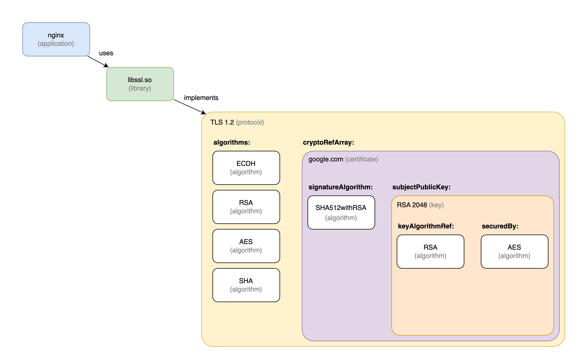

# Cryptography Bill of Materials - Examples

This document provides examples for using Cryptography Bills of Materials (CBOMs).

- [Cryptography Bill of Materials - Examples](#cryptography-bill-of-materials---examples)
- [Components](#components)
  - [Algorithm](#algorithm)
  - [Key](#key)
  - [Protocol](#protocol)
  - [Library](#library)
  - [Application](#application)
  - [Certificate](#certificate)
  - [CBOM Project Metadata](#cbom-project-metadata)
- [Dependencies](#dependencies)

# Components

## Algorithm

A crypto algorithm is added in the `components` array of the BOM. The examples below lists the algorithm `AES-128-GCM` and `SHA512withRSA`.

```json
"components": [
    {
        "name": "AES-128-GCM",
        "type": "crypto-asset",
        "bom-ref": "pkg:crypto/algorithm/aes-128-gcm@2.16.840.1.101.3.4.1.6",
        "purl": "pkg:crypto/algorithm/aes-128-gcm@2.16.840.1.101.3.4.1.6",
        "cryptoProperties": {
            "assetType": "algorithm",
            "algorithmProperties": {
                "variant": "aes-128-gcm",
                "primitive": "ae",
                "mode": "gcm",
                "implementationLevel": "softwarePlainRam",
                "implementationPlatform": "x86_64",
                "certificationLevel": "none",
                "cryptoFunctions": [
                    "keygen", 
                    "encrypt", 
                    "decrypt", 
                    "tag"
                ],
                "classicalSecurityLevel": 128,
                "nistQuantumSecurityLevel": 1
            },
            "oid": "2.16.840.1.101.3.4.1.6"
        }
    },
    {
        "name": "SHA512withRSA",
        "type": "crypto-asset",
        "bom-ref": "pkg:crypto/algorithm/sha-512-rsa@1.2.840.113549.1.1.13",
        "purl": "pkg:crypto/algorithm/sha-512-rsa@1.2.840.113549.1.1.13",
        "cryptoProperties": {
            "assetType": "algorithm",
            "algorithmProperties": {
                "variant": "sha-512-rsa",
                "implementationLevel": "softwarePlainRam",
                "implementationPlatform": "x86_64",
                "certificationLevel": "none",
                "cryptoFunctions": [
                    "digest"
                ],
                "nistQuantumSecurityLevel": 0
            },
            "oid": "1.2.840.113549.1.1.13"
        }
    }
]
```

An example with the QSC Signature algorithm `Dilithium5` is listed below.

```json
"components": [
    {
        "name": "Dilithium5",
        "type": "crypto-asset",
        "bom-ref": "pkg:crypto/algorithm/dilithium5@1.3.6.1.4.1.2.267.7.8.7",
        "purl": "pkg:crypto/algorithm/dilithium5@1.3.6.1.4.1.2.267.7.8.7",
        "cryptoProperties": {
            "assetType": "algorithm",
            "algorithmProperties": {
                "variant": "dilithium5",
                "primitive": "signature",
                "implementationLevel": "softwarePlainRam",
                "implementationPlatform": "x86_64",
                "certificationLevel": "none",
                "cryptoFunctions": ["keygen", "sign", "verify"],
                "nistQuantumSecurityLevel": 5
            },
            "oid": "1.3.6.1.4.1.2.267.7.8.7"
        }
    }
]
```

## Key

A cryptographic key is added in the `components` array of the BOM. The example below lists an `RSA-2048` public key.

```json
"components": [
    {
        "name": "RSA-2048",
        "type": "crypto-asset",
        "bom-ref": "pkg:crypto/key/rsa-2048@1.2.840.113549.1.1.1",
        "purl": "pkg:crypto/key/rsa-2048@1.2.840.113549.1.1.1",
        "cryptoProperties": {
            "assetType": "key",
            "keyProperties": {
                "type": "publicKey",
                "id": "2e9ef09e-dfac-4526-96b4-d02f31af1b22",
                "state": "active",
                "size": 2048,
                "keyAlgorithmRef": "pkg:crypto/algorithm/rsa-2048@1.2.840.113549.1.1.1",
                "securedBy": {
                    "mechanism": "Software",
                    "algorithmRef": "pkg:crypto/algorithm/aes-128-gcm@2.16.840.1.101.3.4.1.6"
                },
                "creationDate": "2016-11-21T08:00:00Z",
                "activationDate": "2016-11-21T08:20:00Z",
            },
            "oid": "1.2.840.113549.1.1.1"
        }
    },
    {
        "name": "RSA-2048",
        "type": "crypto-asset",
        "bom-ref": "pkg:crypto/algorithm/rsa-2048@1.2.840.113549.1.1.1",
        "purl": "pkg:crypto/algorithm/rsa-2048@1.2.840.113549.1.1.1",
        "cryptoProperties": {
            "assetType": "algorithm",
            "algorithmProperties": {
                "variant": "rsa-2048",
                "implementationLevel": "softwarePlainRam",
                "implementationPlatform": "x86_64",
                "certificationLevel": "none",
                "cryptoFunctions": [
                    "encapsulate",
                    "decapsulate"
                ],
            },
            "oid": "1.2.840.113549.1.1.1"
        }
    },
    {
        "name": "AES-128-GCM",
        "type": "crypto-asset",
        "bom-ref": "pkg:crypto/algorithm/aes-128-gcm@2.16.840.1.101.3.4.1.6",
        "purl": "pkg:crypto/algorithm/aes-128-gcm@2.16.840.1.101.3.4.1.6",
        "cryptoProperties": {
            "assetType": "algorithm",
            "algorithmProperties": {
                "variant": "aes-128-gcm",
                "primitive": "ae",
                "mode": "gcm",
                "implementationLevel": "softwarePlainRam",
                "implementationPlatform": "x86_64",
                "certificationLevel": "none",
                "cryptoFunctions": [
                    "keygen", 
                    "encrypt", 
                    "decrypt"
                ],
                "classicalSecurityLevel": 128,
                "nistQuantumSecurityLevel": 1
            },
            "oid": "2.16.840.1.101.3.4.1.6"
        }
    }
]
```


## Protocol

A cryptographic protocol is added to the `components` array of the BOM. The example below lists an instance of the protocol `TLS v1.2` with a number of TLS cipher suites.

```json
"components": [
    {
        "name": "TLSv1.2",
        "type": "crypto-asset",
        "bom-ref": "pkg:crypto/protocol/tls@1.2",
        "purl": "pkg:crypto/protocol/tls@1.2",
        "cryptoProperties": {
            "assetType": "protocol",
            "protocolProperties": {
                "type": "tls",
                "version": "1.2",
                "cipherSuites": [
                    {
                        "name": "TLS_ECDHE_RSA_WITH_AES_256_GCM_SHA384",
                        "algorithms": [
                            "pkg:crypto/algorithm/ecdh-curve25519@1.3.132.1.12",
                            "pkg:crypto/algorithm/rsa-2048@1.2.840.113549.1.1.1",
                            "pkg:crypto/algorithm/aes-128-gcm@2.16.840.1.101.3.4.1.6",
                            "pkg:crypto/algorithm/sha-384@2.16.840.1.101.3.4.2.9"
                        ],
                        "identifiers": [
                            "0xC0",
                            "0x30"
                        ]
                    }
                ],
                "cryptoRefArray": [
                    "pkg:crypto/certificate/google.com@sha256:1e15e0fbd3ce95bde5945633ae96add551341b11e5bae7bba12e98ad84a5beb4"
                ]
            },
            "oid": "1.3.18.0.2.32.104"
        }
    },
    {
        "name": "google.com",
        "type": "crypto-asset",
        "bom-ref": "pkg:crypto/certificate/google.com@sha256:1e15e0fbd3ce95bde5945633ae96add551341b11e5bae7bba12e98ad84a5beb4",
        "purl": "pkg:crypto/certificate/google.com@sha256:1e15e0fbd3ce95bde5945633ae96add551341b11e5bae7bba12e98ad84a5beb4",
        "cryptoProperties": {
            "assetType": "certificate",
            "certificateProperties": {
                "subjectName": "CN = www.google.com",
                "issuerName": "C = US, O = Google Trust Services LLC, CN = GTS CA 1C3",
                "notValidBefore": "2016-11-21T08:00:00Z",
                "notValidAfter": "2017-11-22T07:59:59Z",
                "signatureAlgorithm": "pkg:crypto/algorithm/sha512-rsa@1.2.840.113549.1.1.13",
                "subjectPublicKey": "pkg:crypto/key/rsa2048@1.2.840.113549.1.1.1",
                "certificateFormat": "X.509",
                "certificateExtension": "crt"
            }
        }
    },
    {
        "name": "SHA512withRSA",
        "type": "crypto-asset",
        "bom-ref": "pkg:crypto/algorithm/sha-512-rsa@1.2.840.113549.1.1.13",
        "purl": "pkg:crypto/algorithm/sha-512-rsa@1.2.840.113549.1.1.13",
        "cryptoProperties": {
            "assetType": "algorithm",
            "algorithmProperties": {
                "variant": "sha-512-rsa",
                "implementationLevel": "softwarePlainRam",
                "implementationPlatform": "x86_64",
                "certificationLevel": "none",
                "cryptoFunctions": [
                    "digest"
                ],
                "nistQuantumSecurityLevel": 0
            },
            "oid": "1.2.840.113549.1.1.13"
        }
    },
    {
        "name": "RSA-2048",
        "type": "crypto-asset",
        "bom-ref": "pkg:crypto/key/rsa-2048@1.2.840.113549.1.1.1",
        "purl": "pkg:crypto/key/rsa-2048@1.2.840.113549.1.1.1",
        "cryptoProperties": {
            "assetType": "key",
            "keyProperties": {
                "type": "publicKey",
                "id": "2e9ef09e-dfac-4526-96b4-d02f31af1b22",
                "state": "active",
                "size": 2048,
                "keyAlgorithmRef": "pkg:crypto/algorithm/rsa-2048@1.2.840.113549.1.1.1",
                "securedBy": {
                    "mechanism": "Software",
                    "algorithmRef": "pkg:crypto/algorithm/aes-128-gcm@2.16.840.1.101.3.4.1.6"
                },
                "creationDate": "2016-11-21T08:00:00Z",
                "activationDate": "2016-11-21T08:20:00Z",
            },
            "oid": "1.2.840.113549.1.1.1"
        }
    },
    {
        "name": "ECDH",
        "type": "crypto-asset",
        "bom-ref": "pkg:crypto/algorithm/ecdh-curve25519@1.3.132.1.12",
        "purl": "pkg:crypto/algorithm/ecdh-curve25519@1.3.132.1.12",
        "cryptoProperties": {
            "assetType": "algorithm",
            "algorithmProperties": {
                "variant": "ecdh-curve25519",
                "curve": "curve25519",
                "implementationLevel": "softwarePlainRam",
                "implementationPlatform": "x86_64",
                "certificationLevel": "none",
                "cryptoFunctions": [
                    "keygen",
                ],
            },
            "oid": "1.3.132.1.12"
        }
    },
    {
        "name": "RSA-2048",
        "type": "crypto-asset",
        "bom-ref": "pkg:crypto/algorithm/rsa-2048@1.2.840.113549.1.1.1",
        "purl": "pkg:crypto/algorithm/rsa-2048@1.2.840.113549.1.1.1",
        "cryptoProperties": {
            "assetType": "algorithm",
            "algorithmProperties": {
                "variant": "rsa-2048",
                "implementationLevel": "softwarePlainRam",
                "implementationPlatform": "x86_64",
                "certificationLevel": "none",
                "cryptoFunctions": [
                    "encapsulate",
                    "decapsulate"
                ],
            },
            "oid": "1.2.840.113549.1.1.1"
        }
    },
    {
        "name": "AES-256-GCM",
        "type": "crypto-asset",
        "bom-ref": "pkg:crypto/algorithm/aes-256-gcm@2.16.840.1.101.3.4.1.46",
        "purl": "pkg:crypto/algorithm/aes-256-gcm@2.16.840.1.101.3.4.1.46",
        "cryptoProperties": {
            "assetType": "algorithm",
            "algorithmProperties": {
                "variant": "aes-256-gcm",
                "primitive": "ae",
                "mode": "gcm",
                "implementationLevel": "softwarePlainRam",
                "implementationPlatform": "x86_64",
                "certificationLevel": "none",
                "cryptoFunctions": [ 
                    "encrypt", 
                    "decrypt"
                ],
                "classicalSecurityLevel": 128,
                "nistQuantumSecurityLevel": 1
            },
            "oid": "2.16.840.1.101.3.4.1.46"
        }
    },
    {
        "name": "SHA384",
        "type": "crypto-asset",
        "bom-ref": "pkg:crypto/algorithm/sha-384@2.16.840.1.101.3.4.2.9",
        "purl": "pkg:crypto/algorithm/sha-384@2.16.840.1.101.3.4.2.9",
        "cryptoProperties": {
            "assetType": "algorithm",
            "algorithmProperties": {
                "variant": "sha-384",
                "implementationLevel": "softwarePlainRam",
                "implementationPlatform": "x86_64",
                "certificationLevel": "none",
                "cryptoFunctions": [
                    "digest", 
                ],
                "nistQuantumSecurityLevel": 2
            },
            "oid": "2.16.840.1.101.3.4.2.9"
        }
    }
]
```

## Library

Crypto libraries use the standard CycloneDX type `library`. A way to declare the bom-ref is to use [CPE](https://nvd.nist.gov/products/cpe). The example below lists the OpenSSL 1.1.1q library:

```json
"components": [
    {
        "type": "library",
        "bom-ref": "cpe:2.3:a:openssl:openssl:1.1.1q:*:*:*:*:*:*:*",
        "name": "openssl",
        "version": "1.1.1q"
    }
]      
```

## Application

Applications use the standard CycloneDX type `application`. A way to declare the bom-ref is to use [CPE](https://nvd.nist.gov/products/cpe). The example below lists the nginx 1.23.2 application:

```json
"components": [
    {
        "type": "application",
        "bom-ref": "cpe:2.3:a:f5:nginx:1.23.2:*:*:*:*:*:*:*",
        "name": "nginx",
        "version": "1.23.2"
    }
]
```

## Certificate

A crypto algorithm is added in the `components` array of the BOM. The example below lists a X.509 certificate.

```json
"components": [
    {
        "name": "google.com",
        "type": "crypto-asset",
        "bom-ref": "pkg:crypto/certificate/google.com@sha256:1e15e0fbd3ce95bde5945633ae96add551341b11e5bae7bba12e98ad84a5beb4",
        "purl": "pkg:crypto/certificate/google.com@sha256:1e15e0fbd3ce95bde5945633ae96add551341b11e5bae7bba12e98ad84a5beb4",
        "cryptoProperties": {
            "assetType": "certificate",
            "certificateProperties": {
                "subjectName": "CN = www.google.com",
                "issuerName": "C = US, O = Google Trust Services LLC, CN = GTS CA 1C3",
                "notValidBefore": "2016-11-21T08:00:00Z",
                "notValidAfter": "2017-11-22T07:59:59Z",
                "signatureAlgorithm": "pkg:crypto/algorithm/sha-512-rsa@1.2.840.113549.1.1.13",
                "subjectPublicKey": "pkg:crypto/key/rsa-2048@1.2.840.113549.1.1.1",
                "certificateFormat": "X.509",
                "certificateExtension": "crt"
            }
        }
    },
    {
        "name": "SHA512withRSA",
        "type": "crypto-asset",
        "bom-ref": "pkg:crypto/algorithm/sha-512-rsa@1.2.840.113549.1.1.13",
        "purl": "pkg:crypto/algorithm/sha-512-rsa@1.2.840.113549.1.1.13",
        "cryptoProperties": {
            "assetType": "algorithm",
            "algorithmProperties": {
                "variant": "sha-512-rsa",
                "implementationLevel": "softwarePlainRam",
                "implementationPlatform": "x86_64",
                "certificationLevel": "none",
                "cryptoFunctions": [
                    "digest"
                ],
                "nistQuantumSecurityLevel": 0
            },
            "oid": "1.2.840.113549.1.1.13"
        }
    },
    {
        "name": "RSA-2048",
        "type": "crypto-asset",
        "bom-ref": "pkg:crypto/key/rsa-2048@1.2.840.113549.1.1.1",
        "purl": "pkg:crypto/key/rsa-2048@1.2.840.113549.1.1.1",
        "cryptoProperties": {
            "assetType": "key",
            "keyProperties": {
                "type": "publicKey",
                "id": "2e9ef09e-dfac-4526-96b4-d02f31af1b22",
                "state": "active",
                "size": 2048,
                "keyAlgorithmRef": "pkg:crypto/algorithm/rsa-2048@1.2.840.113549.1.1.1",
                "securedBy": {
                    "mechanism": "None"
                },
                "creationDate": "2016-11-21T08:00:00Z",
                "activationDate": "2016-11-21T08:20:00Z",
            },
            "oid": "1.2.840.113549.1.1.1"
        }
    },
    {
        "name": "RSA-2048",
        "type": "crypto-asset",
        "bom-ref": "pkg:crypto/algorithm/rsa-2048@1.2.840.113549.1.1.1",
        "purl": "pkg:crypto/algorithm/rsa-2048@1.2.840.113549.1.1.1",
        "cryptoProperties": {
            "assetType": "algorithm",
            "algorithmProperties": {
                "variant": "rsa-2048",
                "implementationLevel": "softwarePlainRam",
                "implementationPlatform": "x86_64",
                "certificationLevel": "none",
                "cryptoFunctions": [
                    "encapsulate",
                    "decapsulate"
                ],
            },
            "oid": "1.2.840.113549.1.1.1"
        }
    }
]
```

## CBOM Project Metadata

The `metadata` property of CBOM is used to describe the main project component.

```json
{
    "bomFormat": "CBOM",
    "specVersion": "1.5-cbom-1.1",
    "serialNumber": "urn:uuid:63304c0b-0d43-43cb-b0a7-f75b4b7ecf98",
    "version": 1,
    "metadata": {
        "timestamp": "2022-11-30T10:22:42.812881+00:00",
        "component": {
            "type": "application",
            "bom-ref": "pkg:github.com/nginx/nginx@release-1.25.1",
            "name": "nginx",
            "version": "1.25.1"
        }
    },
    "components": [
      ...
    ]
}
```

# Dependencies

Dependencies between components in the `components` array are added to the `dependencies` array.

The two dependency types are:

- `implements`: refers to crypto assets implemented, or statically available in a component. Examples are the algorithms provided by crypto libraries. A crypto asset 'implemented' by a component does not imply that it is in use.
- `uses`: refers to crypto assets in use, or being referenced by other components. The referencing can be done by explicit function calls or by configuration at run time. Usage may change over time, so CBOMs always represent a snapshot at a given point in time.

A component can have a dependencies of both types `implements` and `uses`. A crypto asset A is considered as 'used' by component C if there is a `used` dependency path from C to A.

> **Note:** In classic SBOM, a component represents a library, application, service, etc. that is used as a dependency within the application. Since for some crypto, e.g. the relationship between a protocol and the algorithms used, this relationship is not external but internal, we decided to express this relationship differently by using specific properties to reference assets rather than using the classical dependency implementation.

Example:



The example shows an application (nginx) that uses the `libssl` cryptographic library. This library implements the `TLSv1.2` protocol. The relationship between the application, the library and the protocol can be expressed by using the `depenedencies` properties of the SBOM standard.

Since a tls protocol supports different cipher suites that include multiple algorithms, there should be a way to represent these relationships as part of the CBOM. Compared to adding the algorithms as "classic" dependencies to the protocol, we defined special property fields that allow referencing the deployment with additional meaning. The protocolProperties allow adding an array of algorithms to a cipher suite as part of the cipher suite array. By modeling and then referencing these algorithms, we can still have only one classical component at the SBOM level, but a subtree of crypto dependencies within the crypto asset components.


```json
{
    "bomFormat": "CBOM",
    "specVersion": "1.5-cbom-1.1",
    "serialNumber": "urn:uuid:63304c0b-0d43-43cb-b0a7-f75b4b7ecf98",
    "version": 1,
    "metadata": {
        "timestamp": "2022-11-30T10:22:42.812881+00:00",
        "component": {
            "type": "application",
            "bom-ref": "pkg:github.com/nginx/nginx@release-1.25.1",
            "name": "nginx",
            "version": "1.25.1"
        }
    },
    "components": [
        {
            "type": "application",
            "bom-ref": "pkg:github.com/nginx/nginx@release-1.25.1",
            "name": "nginx",
            "version": "1.25.1"
        },
        {
            "type": "library",
            "bom-ref": "pkg:github.com/openssl/openssl@3.1.2",
            "name": "libssl",
            "version": "3.1.2"
        },
        {
            "name": "TLSv1.2",
            "type": "crypto-asset",
            "bom-ref": "pkg:crypto/protocol/tls@1.2",
            "purl": "pkg:crypto/protocol/tls@1.2",
            "cryptoProperties": {
                "assetType": "protocol",
                "protocolProperties": {
                    "type": "tls",
                    "version": "1.2",
                    "cipherSuites": [
                        {
                            "name": "TLS_ECDHE_RSA_WITH_AES_256_GCM_SHA384",
                            "algorithms": [
                                "pkg:crypto/algorithm/ecdh-curve25519@1.3.132.1.12",
                                "pkg:crypto/algorithm/rsa-2048@1.2.840.113549.1.1.1",
                                "pkg:crypto/algorithm/aes-128-gcm@2.16.840.1.101.3.4.1.6",
                                "pkg:crypto/algorithm/sha-384@2.16.840.1.101.3.4.2.9"
                            ],
                            "identifiers": [
                                "0xC0",
                                "0x30"
                            ]
                        }
                    ],
                    "cryptoRefArray": [
                        "pkg:crypto/certificate/google.com@sha256:1e15e0fbd3ce95bde5945633ae96add551341b11e5bae7bba12e98ad84a5beb4"
                    ]
                },
                "oid": "1.3.18.0.2.32.104"
            }
        },
        {
            "name": "google.com",
            "type": "crypto-asset",
            "bom-ref": "pkg:crypto/certificate/google.com@sha256:1e15e0fbd3ce95bde5945633ae96add551341b11e5bae7bba12e98ad84a5beb4",
            "purl": "pkg:crypto/certificate/google.com@sha256:1e15e0fbd3ce95bde5945633ae96add551341b11e5bae7bba12e98ad84a5beb4",
            "cryptoProperties": {
                "assetType": "certificate",
                "certificateProperties": {
                    "subjectName": "CN = www.google.com",
                    "issuerName": "C = US, O = Google Trust Services LLC, CN = GTS CA 1C3",
                    "notValidBefore": "2016-11-21T08:00:00Z",
                    "notValidAfter": "2017-11-22T07:59:59Z",
                    "signatureAlgorithm": "pkg:crypto/algorithm/sha512-rsa@1.2.840.113549.1.1.13",
                    "subjectPublicKey": "pkg:crypto/key/rsa2048@1.2.840.113549.1.1.1",
                    "certificateFormat": "X.509",
                    "certificateExtension": "crt"
                }
            }
        },
        {
            "name": "SHA512withRSA",
            "type": "crypto-asset",
            "bom-ref": "pkg:crypto/algorithm/sha-512-rsa@1.2.840.113549.1.1.13",
            "purl": "pkg:crypto/algorithm/sha-512-rsa@1.2.840.113549.1.1.13",
            "cryptoProperties": {
                "assetType": "algorithm",
                "algorithmProperties": {
                    "variant": "sha-512-rsa",
                    "implementationLevel": "softwarePlainRam",
                    "implementationPlatform": "x86_64",
                    "certificationLevel": "none",
                    "cryptoFunctions": [
                        "digest"
                    ],
                    "nistQuantumSecurityLevel": 0
                },
                "oid": "1.2.840.113549.1.1.13"
            }
        },
        {
            "name": "RSA-2048",
            "type": "crypto-asset",
            "bom-ref": "pkg:crypto/key/rsa-2048@1.2.840.113549.1.1.1",
            "purl": "pkg:crypto/key/rsa-2048@1.2.840.113549.1.1.1",
            "cryptoProperties": {
                "assetType": "key",
                "keyProperties": {
                    "type": "publicKey",
                    "id": "2e9ef09e-dfac-4526-96b4-d02f31af1b22",
                    "state": "active",
                    "size": 2048,
                    "keyAlgorithmRef": "pkg:crypto/algorithm/rsa-2048@1.2.840.113549.1.1.1",
                    "securedBy": {
                        "mechanism": "Software",
                        "algorithmRef": "pkg:crypto/algorithm/aes-128-gcm@2.16.840.1.101.3.4.1.6"
                    },
                    "creationDate": "2016-11-21T08:00:00Z",
                    "activationDate": "2016-11-21T08:20:00Z",
                },
                "oid": "1.2.840.113549.1.1.1"
            }
        },
        {
            "name": "ECDH",
            "type": "crypto-asset",
            "bom-ref": "pkg:crypto/algorithm/ecdh-curve25519@1.3.132.1.12",
            "purl": "pkg:crypto/algorithm/ecdh-curve25519@1.3.132.1.12",
            "cryptoProperties": {
                "assetType": "algorithm",
                "algorithmProperties": {
                    "variant": "ecdh-curve25519",
                    "curve": "curve25519",
                    "implementationLevel": "softwarePlainRam",
                    "implementationPlatform": "x86_64",
                    "certificationLevel": "none",
                    "cryptoFunctions": [
                        "keygen",
                    ],
                },
                "oid": "1.3.132.1.12"
            }
        },
        {
            "name": "RSA-2048",
            "type": "crypto-asset",
            "bom-ref": "pkg:crypto/algorithm/rsa-2048@1.2.840.113549.1.1.1",
            "purl": "pkg:crypto/algorithm/rsa-2048@1.2.840.113549.1.1.1",
            "cryptoProperties": {
                "assetType": "algorithm",
                "algorithmProperties": {
                    "variant": "rsa-2048",
                    "implementationLevel": "softwarePlainRam",
                    "implementationPlatform": "x86_64",
                    "certificationLevel": "none",
                    "cryptoFunctions": [
                        "encapsulate",
                        "decapsulate"
                    ],
                },
                "oid": "1.2.840.113549.1.1.1"
            }
        },
        {
            "name": "AES-256-GCM",
            "type": "crypto-asset",
            "bom-ref": "pkg:crypto/algorithm/aes-256-gcm@2.16.840.1.101.3.4.1.46",
            "purl": "pkg:crypto/algorithm/aes-256-gcm@2.16.840.1.101.3.4.1.46",
            "cryptoProperties": {
                "assetType": "algorithm",
                "algorithmProperties": {
                    "variant": "aes-256-gcm",
                    "primitive": "ae",
                    "mode": "gcm",
                    "implementationLevel": "softwarePlainRam",
                    "implementationPlatform": "x86_64",
                    "certificationLevel": "none",
                    "cryptoFunctions": [ 
                        "encrypt", 
                        "decrypt"
                    ],
                    "classicalSecurityLevel": 128,
                    "nistQuantumSecurityLevel": 1
                },
                "oid": "2.16.840.1.101.3.4.1.46"
            }
        },
        {
            "name": "SHA384",
            "type": "crypto-asset",
            "bom-ref": "pkg:crypto/algorithm/sha-384@2.16.840.1.101.3.4.2.9",
            "purl": "pkg:crypto/algorithm/sha-384@2.16.840.1.101.3.4.2.9",
            "cryptoProperties": {
                "assetType": "algorithm",
                "algorithmProperties": {
                    "variant": "sha-384",
                    "implementationLevel": "softwarePlainRam",
                    "implementationPlatform": "x86_64",
                    "certificationLevel": "none",
                    "cryptoFunctions": [
                        "digest", 
                    ],
                    "nistQuantumSecurityLevel": 2
                },
                "oid": "2.16.840.1.101.3.4.2.9"
            }
        }
    ],
    "dependencies": [
        {
            "ref" : "pkg:github.com/nginx/nginx@release-1.25.1",
            "dependsOn" : [
                "pkg:github.com/openssl/openssl@3.1.2"
            ],
            "dependencyType" : "uses"
        },
        {
            "ref" : "pkg:github.com/openssl/openssl@3.1.2",
            "dependsOn" : [
                "pkg:crypto/protocol/tls@1.2"
            ],
            "dependencyType" : "implements"
        }
    ]
}
```