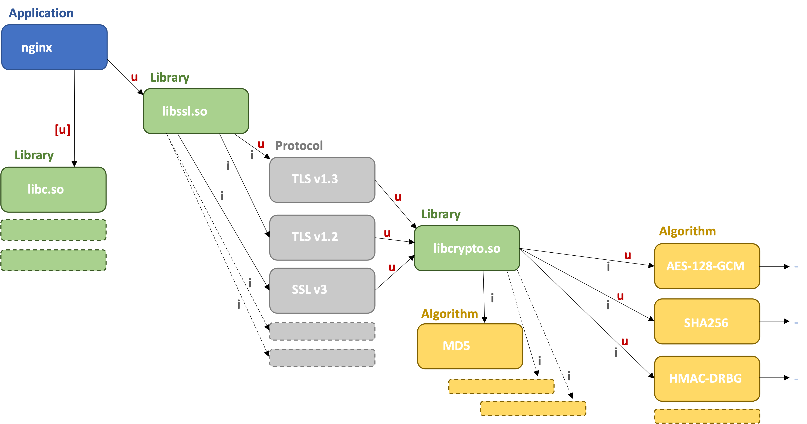
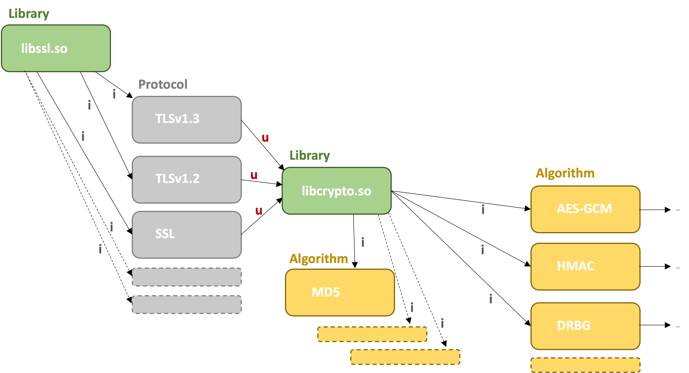

# Cryptography Bill of Materials - Examples

This document provides examples for using Cryptography Bills of Materials (CBOMs).

- [Cryptography Bill of Materials - Examples](#cryptography-bill-of-materials---examples)
- [Components](#components)
  - [Algorithm](#algorithm)
  - [Protocol](#protocol)
  - [Library](#library)
  - [Application](#application)
  - [Certificate](#certificate)
  - [Releated Crypto Material](#releated-crypto-material)
  - [CBOM Project Metadata](#cbom-project-metadata)
- [Dependencies](#dependencies)
  - [Dependencies viewed from an application](#dependencies-viewed-from-an-application)
  - [Dependencies viewed from a library](#dependencies-viewed-from-a-library)

# Components

## Algorithm

A crypto algorithm is added in the `components` array of the BOM. The example below lists the algorithm `AES-128-GCM`. As reference key (`bom-ref`), the algorithm OID is chosen.

```
    "components": [
    ...
      {
        "type": "crypto-asset",
        "bom-ref": "oid:2.16.840.1.101.3.4.1.6",
        "name": "AES",
        "cryptoProperties": {
            "assetType": "algorithm",
            "algorithmProperties": {
                "variant": "AES-128-GCM",
                "primitive": "ae",
                "mode": "gcm",
                "implementationLevel": "softwarePlainRam",
                "implementationPlatform": "x86_64",
                "certificationLevel": "none",
                "cryptoFunctions": ["keygen", "encrypt", "decrypt", "tag"]
            },
            "classicalSecurityLevel": 128,
            "quantumSecurityLevel": 1
        }
      }
    ...
    ]
```

An example with the QSC Signature algorithm `Dilithium-5` is listed below. As reference key (`bom-ref`), the algorithm OID is chosen:

```
    "components": [
    ...
      {
        "type": "crypto-asset",
        "bom-ref": "oid:1.3.6.1.4.1.2.267.7.8.7",
        "name": "Dilithium",
        "cryptoProperties": {
            "assetType": "algorithm",
            "algorithmProperties": {
                "variant": "Dilithium-5",
                "primitive": "signature",
                "implementationLevel": "softwarePlainRam",
                "implementationPlatform": "x86_64",
                "certificationLevel": "none",
                "cryptoFunctions": ["keygen", "sign", "verify"]
            },
            "quantumSecurityLevel": 5
        }
      }
    ...
    ]
```


## Protocol

A cryptographic protocol is added to the `components` array of the BOM. The example below lists an instance of the protocol `TLS v1.2` with a number of TLS cipher suites.

```
    "components": [
    ...
      {
        "type": "crypto-asset",
        "bom-ref": "oid:1.3.18.0.2.32.104",
        "name": "tlsv12",
        "cryptoProperties": {
            "assetType": "protocol",
            "protocolProperties": {
                "tlsCipherSuites" : [
                    "TLS_ECDHE_RSA_WITH_AES_256_GCM_SHA384 (ecdh_x25519)", "TLS_ECDHE_RSA_WITH_AES_128_GCM_SHA256 (ecdh_x25519)", "TLS_RSA_WITH_AES_256_GCM_SHA384 (rsa 2048)", "TLS_RSA_WITH_AES_128_GCM_SHA256 (rsa 2048)"
                ]
            }
        }
      }
    ...
    ]
```

## Library

Crypto libraries use the standard CycloneDX type `library`. A way to declare the bom-ref is to use [CPE](https://nvd.nist.gov/products/cpe). The example below lists the OpenSSL 1.1.1q library:

```
    "components": [
    ...
      {
        "type": "library",
        "bom-ref": "cpe:2.3:a:openssl:openssl:1.1.1q:*:*:*:*:*:*:*",
        "name": "openssl",
        "version": "1.1.1q"
      }
    ...
    ]      
```

## Application

Applications use the standard CycloneDX type `application`. A way to declare the bom-ref is to use [CPE](https://nvd.nist.gov/products/cpe). The example below lists the nginx 1.23.2 application:

```
    "components": [
    ...
      {
        "type": "application",
        "bom-ref": "cpe:2.3:a:f5:nginx:1.23.2:*:*:*:*:*:*:*",
        "name": "nginx",
        "version": "1.23.2"
      }
    ...
    ]
```

## Certificate

A crypto algorithm is added in the `components` array of the BOM. The example below lists a X.509 certificate.

```
    "components": [
    ...
      {
        "type": "crypto-asset",
        "bom-ref": "ref:10:e6:fc:62:b7:41:8a:d5:00:5e:45:b6",
        "name": "cert-wikipedia-10:e6:fc:62:b7:41:8a:d5:00:5e:45:b6",
        "cryptoProperties": {
            "assetType": "certificate",
            "certificateProperties": {
                "subjectName": "C=US, ST=California, L=San Francisco, O=Wikimedia Foundation, Inc., CN=*.wikipedia.org",
                "issuerName": "C=BE, O=GlobalSign nv-sa, CN=GlobalSign Organization Validation CA - SHA256 - G2",
                "notValidBefore": "Nov 21 08:00:00 2016 GMT",
                "notValidAfter": "Nov 22 07:59:59 2017 GMT",
                "certificateAlgorithm": "prime256v1",
                "certificateSignatureAlgorithm": "sha256WithRSAEncryption",
                "certificateFormat": "X.509"
            }
        }
      }
    ...
    ]
```

## Releated Crypto Material

Related crypto material is added in the `components` array of the BOM. The example below lists a public key in PEM format:

```
    "components": [
    ...
      {
        "type": "crypto-asset",
        "bom-ref": "ref:10:e6:fc:62:b7:41:8a:d5:00:5e:45:b6",
        "name": "cert-wikipedia-10:e6:fc:62:b7:41:8a:d5:00:5e:45:b6",
        "cryptoProperties": {
            "assetType": "relatedCryptoMaterial",
            "relatedCryptoMaterialProperties": {
                "relatedCryptoMaterialType": "publicKey",
                "size": 3608,
                "format": "PEM",
                "secured": false

            }
        }
      }
    ...
    ]
```

## CBOM Project Metadata

The `metadata` property of CBOM is used to describe the main project component.

```
    "bomFormat": "CBOM",
    "specVersion": "1.4-cbom-1.0",
    "serialNumber": "urn:uuid:63304c0b-0d43-43cb-b0a7-f75b4b7ecf98",
    "version": 1,
    "metadata": {
        "timestamp": "2022-11-30T10:22:42.812881+00:00",
        "component": {
            "type": "application",
            "bom-ref": "cpe:2.3:a:f5:nginx:1.23.2:*:*:*:*:*:*:*",
            "name": "nginx",
            "version": "1.23.2"
        }
    },
    "components": [
      ...
    ]
```

# Dependencies

Dependencies between components in the `components` array are added to the `dependencies` array.

The two dependency types are:

- `implements`: refers to crypto assets implemented, or statically available in a component. Examples are the algorithms provided by crypto libraries. A crypto asset 'implemented' by a component does not imply that it is in use.
- `uses`: refers to crypto assets in use, or being referenced by other components. The referencing can be done by explicit function calls or by configuration at run time. Usage may change over time, so CBOMs always represent a snapshot at a given point in time.

A component can have a dependencies of both types `implements` and `uses`. A crypto asset A is considered as 'used' by component C if there is a `used` dependency path from C to A.

## Dependencies viewed from an application

The chart below shows a partial dependency graph from a CBOM of the application `nginx`. Dependency types `uses` are marked with `u` and dependency types `implements` are marked with `i`.



Key conclusions from the dependency graph:
- A `uses` path exists from nginx to TLS v1.3, AES-128-GCM, SHA256 and HMAC-DRBG. These crypto assets can be considered used by nginx.
- No `uses` paths from nginx to TLS v1.2, SSL v3 and MD5 exists. These crypto assets can be considered implemented by libraries (libssl.so, libcrypto.so) but not used by nginx.

Note: Suppose that SSL v3 uses MD5. The dependency graph will still show no `uses` dependency from libcrypto.so to MD5 since there is no `uses` dependency from any component to SSL v3.

The dependency array of the CBOM will look as follows (for simplicity, we use the crypto asset names as the `bom-ref` property. In practice, one use CPE, purl and OID identifiers):

```
    "dependencies": [
        {
            "ref": "nginx",
            "dependsOn": [
                "libssl"
            ],
            "dependencyType": "uses"
        },
        {
            "ref": "libssl.so",
            "dependsOn": [
                "TLS v1.3", "TLS v1.2", "SSL v3"
            ],
            "dependencyType": "implements"
        },
        {
            "ref": "libssl.so",
            "dependsOn": [
                "TLS v1.3"
            ],
            "dependencyType": "uses"
        },
        {
            "ref": "TLS v1.3",
            "dependsOn": [
                "libcrypto.so"
            ],
            "dependencyType": "uses"
        },
        {
            "ref": "TLS v1.2",
            "dependsOn": [
                "libcrypto.so"
            ],
            "dependencyType": "uses"
        },
        {
            "ref": "SSL v3",
            "dependsOn": [
                "libcrypto.so"
            ],
            "dependencyType": "uses"
        },
        {
            "ref": "libcrypto.so",
            "dependsOn": [
                "MD5", "AES-128-GCM", "SHA256", "HMAC-DRBG"
            ],
            "dependencyType": "implements"
        },
        {
            "ref": "libcrypto.so",
            "dependsOn": [
                "AES-128-GCM", "SHA256", "HMAC-DRBG"
            ],
            "dependencyType": "uses"
        }
    ]
```

## Dependencies viewed from a library

The chart below shows a partial dependency graph from a CBOM of crypto library `libssl.so`.



Key conclusions from the dependency graph:
- libssl.so implements TLS protocol versions TLS v1.3, TLS v1.2 and SSL v3
- The TLS protocols versions TLS v1.3, TLS v1.2 and SSL v3 use libcrypto.so

Note that, in contrast to the dependencies viewed from the application, there are no `uses` dependencies from libcrypto.so to any algorithm. This is because there is no `uses` dependency to any of the TLS protocol versions. If, for example, SSL v3 is the top level component, `uses` dependencies to the algorithms used by SSL v3 are added.

The dependency array of the CBOM will look as follows (for simplicity, we use the crypto asset names as the `bom-ref` property. In practice, one use CPE, purl and OID identifiers):

```
    "dependencies": [
        {
            "ref": "libssl.so",
            "dependsOn": [
                "TLS v1.3", "TLS v1.2", "SSL v3"
            ],
            "dependencyType": "implements"
        },
        {
            "ref": "TLS v1.3",
            "dependsOn": [
                "libcrypto.so"
            ],
            "dependencyType": "uses"
        },
        {
            "ref": "TLS v1.2",
            "dependsOn": [
                "libcrypto.so"
            ],
            "dependencyType": "uses"
        },
        {
            "ref": "SSL v3",
            "dependsOn": [
                "libcrypto.so"
            ],
            "dependencyType": "uses"
        },
        {
            "ref": "libcrypto.so",
            "dependsOn": [
                "MD5", "AES-128-GCM", "SHA256", "HMAC-DRBG"
            ],
            "dependencyType": "implements"
        }
    ]
```
